# 🌐 Networking Labs — Cisco Packet Tracer

## 📋 Project Overview
Built and simulated complete networking labs using 
Cisco Packet Tracer covering LAN, WAN, Wi-Fi, 
DHCP, DNS, VPN and Wi-Fi Troubleshooting.

## 🛠️ Tools & Technologies
| Tool | Details |
|------|---------|
| Software | Cisco Packet Tracer |
| Devices | Cisco Router 4331, Switch 2960 |
| Wireless | WRT300N Wireless Router |
| Protocols | TCP/IP, DHCP, DNS, IPSec VPN |

## ✅ Labs Completed
| Lab | Topic | Status |
|-----|-------|--------|
| Lab 1 | Basic LAN Network | ✅ Done |
| Lab 2 | LAN to WAN Connection | ✅ Done |
| Lab 3 | Wi-Fi Network | ✅ Done |
| Lab 4 | DHCP & DNS Server | ✅ Done |
| Lab 5 | VPN Tunnel | ✅ Done |
| Lab 6 | Wi-Fi Troubleshooting | ✅ Done |

---

## 📸 Screenshots

### 🖥️ Lab 1 — Basic LAN Network

*1️⃣ Basic LAN Complete*

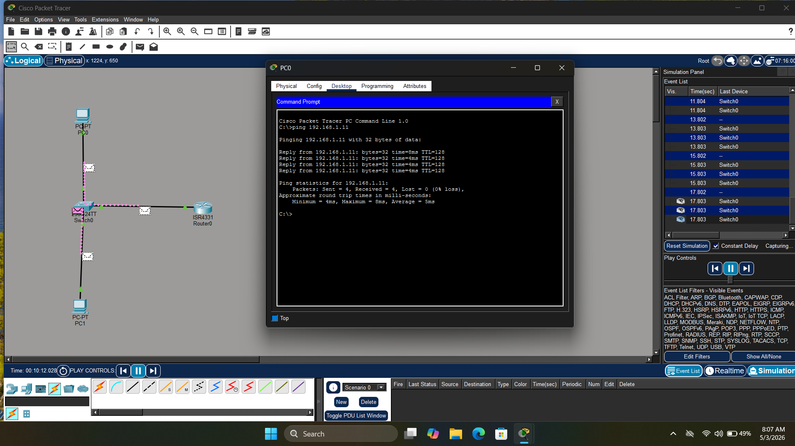

> Built basic LAN network with 2 PCs, Switch and Router
> Assigned static IPs 192.168.1.10 and 192.168.1.11
> Successfully pinged PC1 from PC0 confirming
> full LAN connectivity

---

### 🌐 Lab 2 — LAN to WAN Connection

*2️⃣ LAN to WAN Complete*

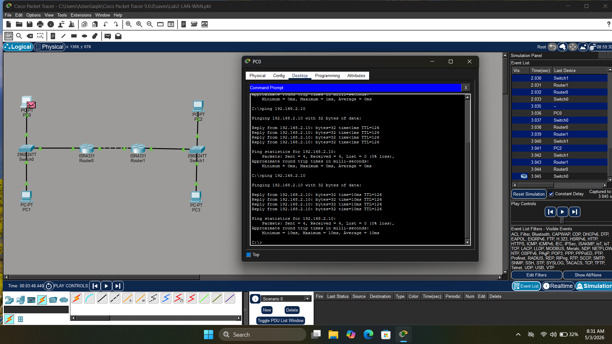

> Connected two separate LANs through WAN link
> LAN1: 192.168.1.0/24 and LAN2: 192.168.2.0/24
> Configured static routes on both routers
> PC0 on LAN1 successfully pinged PC2 on LAN2

---

### 📶 Lab 3 — Wi-Fi Network

*3️⃣ Wi-Fi Network Complete*

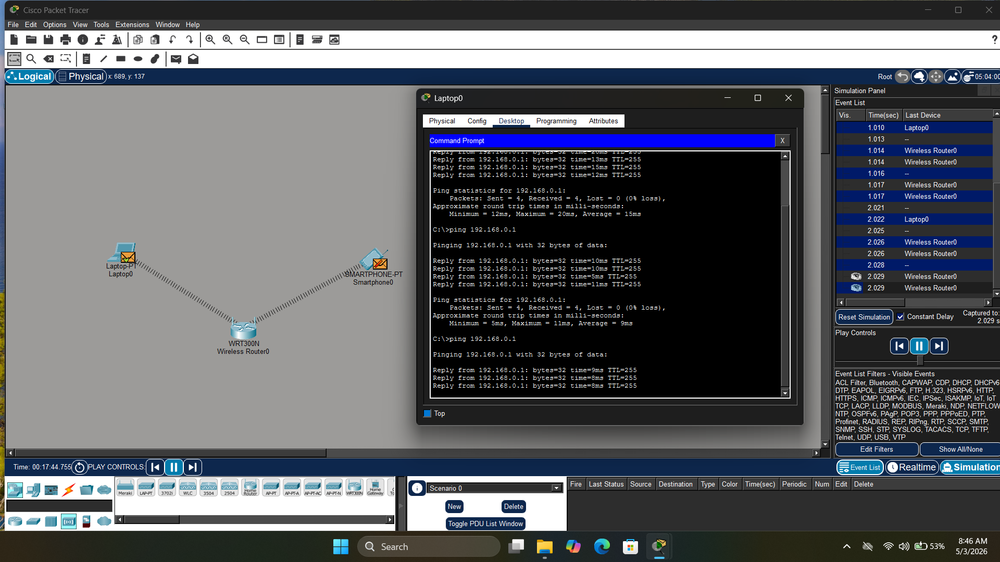

> Built wireless network with WRT300N router
> Connected Laptop and Smartphone via Wi-Fi
> DHCP automatically assigned IPs to both devices
> Successfully pinged between all wireless devices

---

### 🔧 Lab 4 — DHCP Server Configuration

*4️⃣ DHCP Server Config*

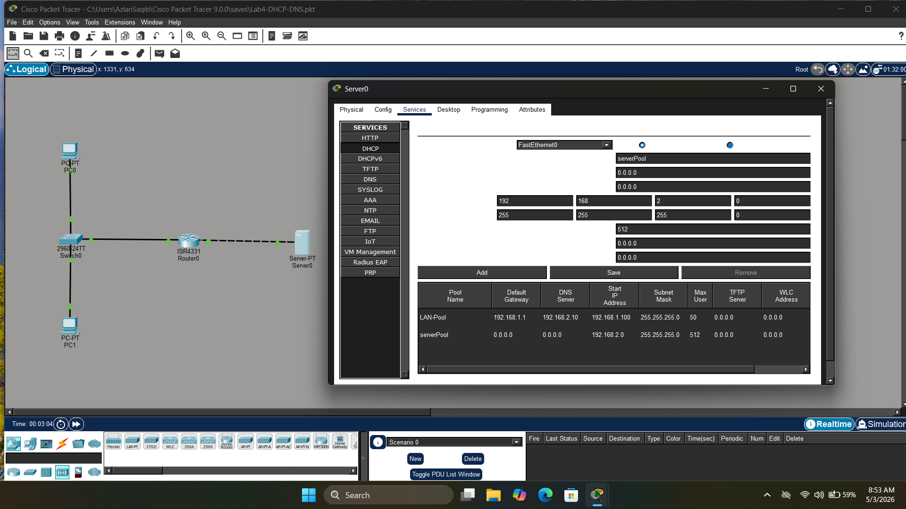

> Configured DHCP server with pool LAN-Pool
> IP range starting 192.168.1.100 with 50 max users
> Default gateway and DNS server assigned automatically
> to all client devices on the network

---

*5️⃣ DNS Server Config*

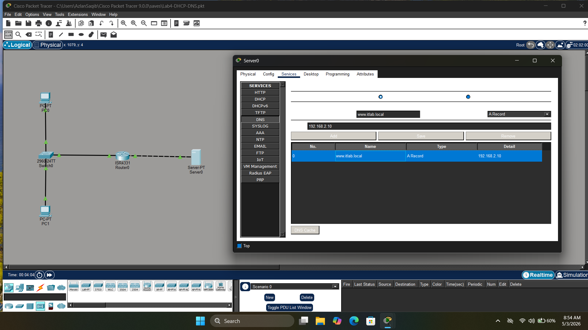

> Configured DNS server with A record
> www.itlab.local resolving to 192.168.2.10
> Demonstrates understanding of DNS zone
> and record management

---

*6️⃣ DNS Ping Result*

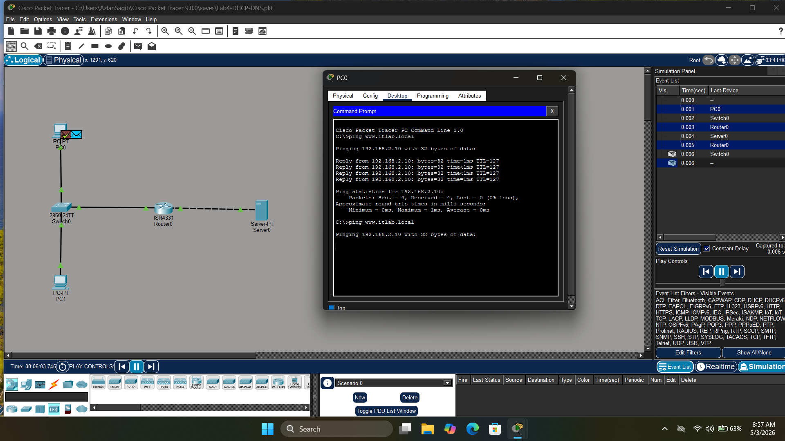

> Successfully pinged www.itlab.local by name
> DNS resolved domain to correct IP 192.168.2.10
> proving DNS server working correctly

---

*7️⃣ DHCP DNS Complete Topology*

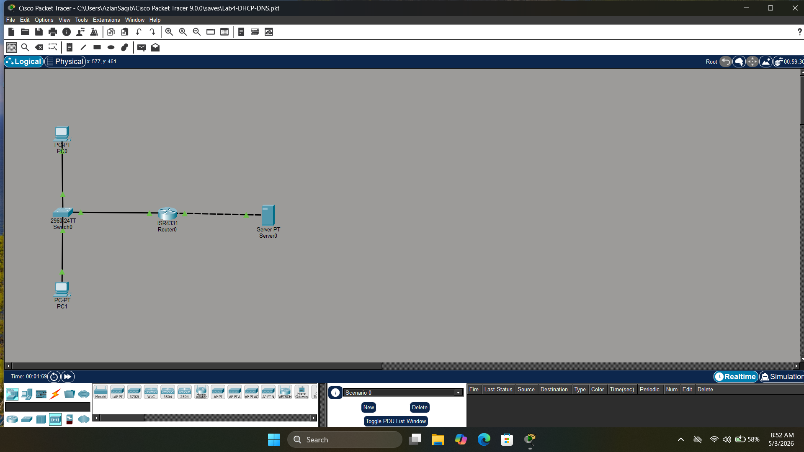

> Full network topology showing Router, Switch,
> Server and 2 PCs all connected and configured
> with DHCP and DNS services running

---

### 🔐 Lab 5 — VPN Tunnel

*8️⃣ VPN Topology*

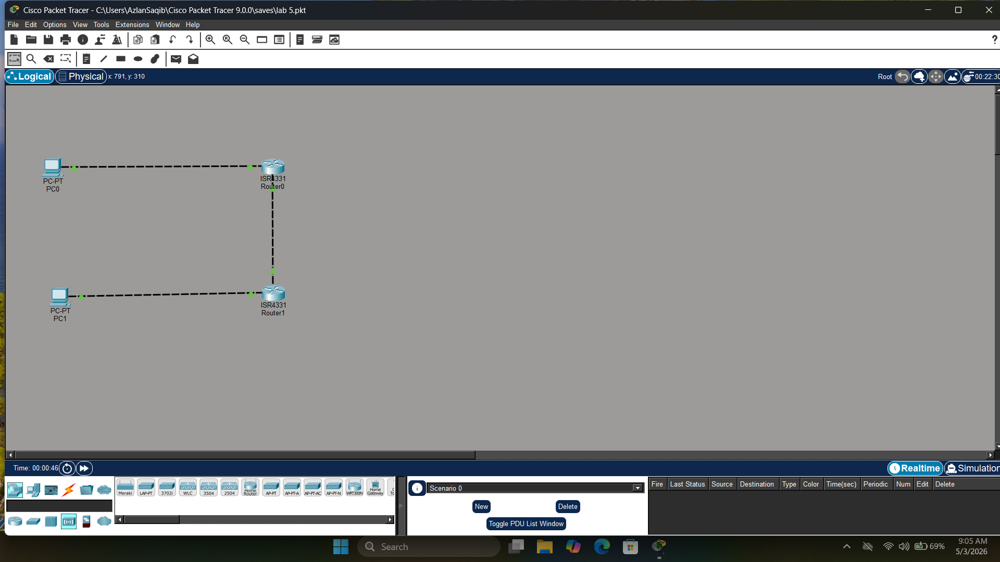

> Built Site-to-Site VPN tunnel between two routers
> using IPSec with AES encryption and SHA hashing
> Pre-shared key authentication configured
> on both Router0 and Router1

---

*9️⃣ VPN Ping & Simulation*

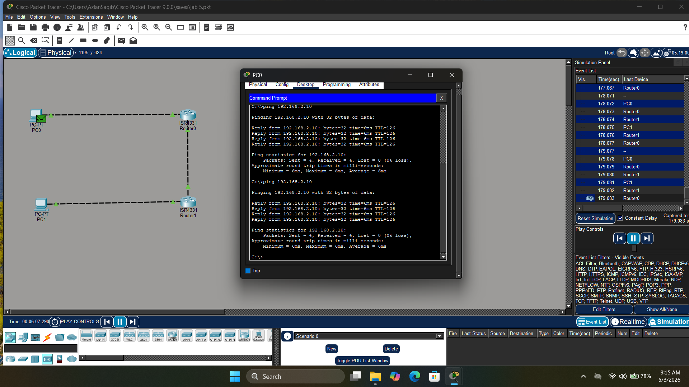

> Successfully pinged across VPN tunnel from
> PC0 (192.168.1.10) to PC1 (192.168.2.10)
> Simulation shows encrypted packets traveling
> securely through VPN tunnel between sites

---

### 📶 Lab 6 — Wi-Fi Troubleshooting

*🔟 Wi-Fi IP Conflict Problem*

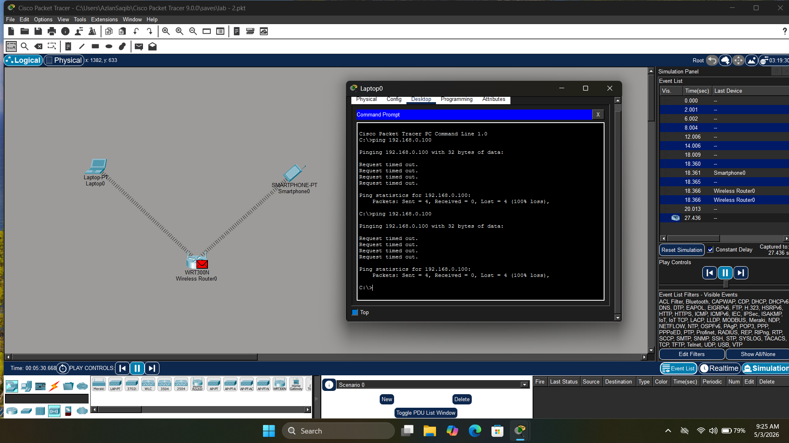

> Simulated IP conflict by assigning same IP
> to both Laptop and Smartphone on Wi-Fi network
> Ping showed request timeout proving
> IP conflict causes connectivity failure

---

*1️⃣1️⃣ Wi-Fi Fix & Success*

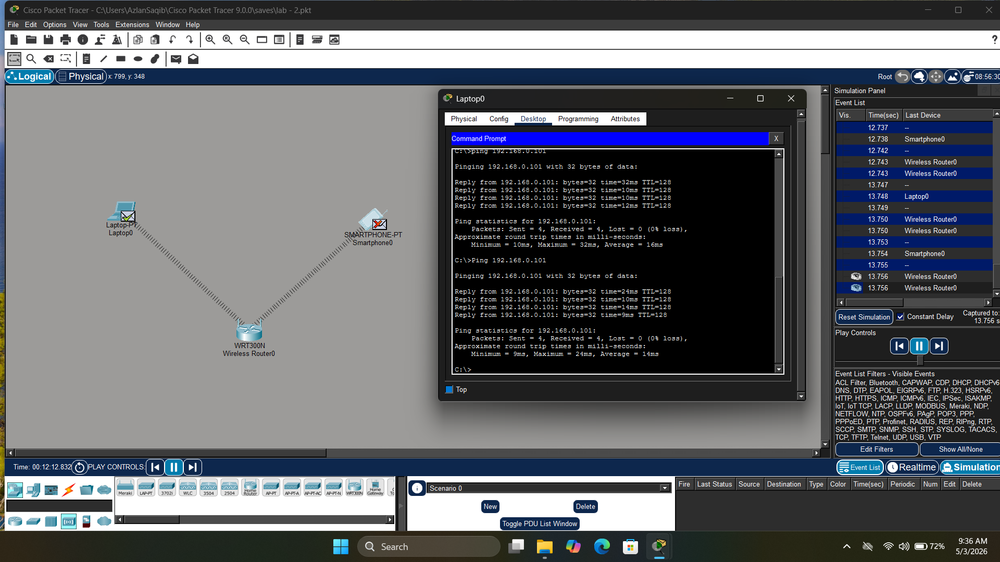

> Fixed IP conflict by assigning unique IP
> to Laptop — ping immediately successful
> Also demonstrated wrong password fix
> by reconnecting with correct WPA2 password

---

## 🎯 Skills Demonstrated
- TCP/IP Network Configuration
- LAN Network Design & Implementation
- WAN Connection & Static Routing
- Wireless Network Setup (Wi-Fi)
- DHCP Server Configuration
- DNS Server Configuration & Testing
- IPSec VPN Tunnel Setup
- Wi-Fi Troubleshooting (IP Conflict, Password)
- Cisco Packet Tracer Simulation
- Network Topology Design
